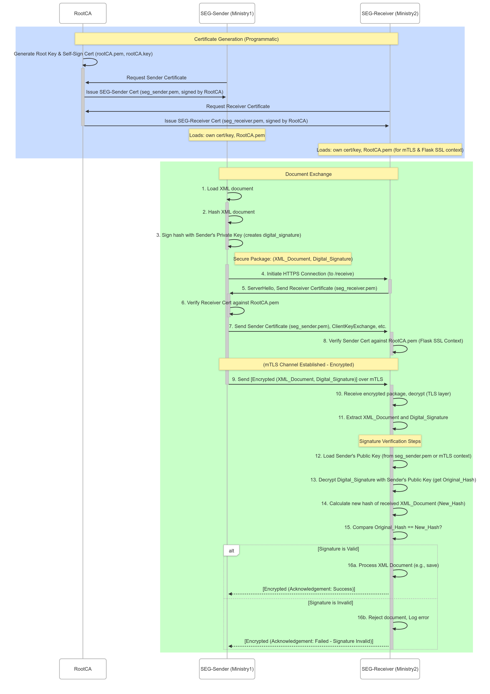

# Secure Exchange Gateway (SEG) Prototype

## Project Overview

This prototype demonstrates a secure method for exchanging sensitive XML documents between two government departments (Ministry 1 and Ministry 2) through their respective Secure Exchange Gateways (SEGs). The main goal is to ensure:

* **Mutual authentication** using mTLS
* **Data confidentiality and integrity**
* **Origin verification** via digital signatures

It simulates:

* `SEG-Sender`: Responsible for signing and sending an XML document.
* `SEG-Receiver`: Validates sender identity, verifies the signature, and saves the document.

---

## Features

* 🔐 Mutual TLS (mTLS) for transport security
* ✍️ RSA-SHA256 Digital Signature for document integrity
* 📄 Signed XML document transmission
* 🔍 Server-side signature verification
* 💾 File-based document submission and reception

---

## System Architecture

1. `SEG-Sender` signs an XML document using its private key.
2. `SEG-Sender` sends the document and its signature to `SEG-Receiver` via HTTPS using mTLS.
3. `SEG-Receiver` verifies the sender's certificate.
4. `SEG-Receiver` validates the signature using the sender's public key.
5. If verified, the XML is saved securely.

---

## Communication Diagram

```
+-------------+             +-------------+
| Ministry 1  |             | Ministry 2  |
| SEG-Sender  |             | SEG-Receiver|
+------+------+             +------+------+
       |                              |
       | 1. Prepare XML Document      |
       | 2. Sign with private key     |
       |----------------------------->|
       | 3. mTLS connection           |
       | 4. Send XML + Signature      |
       |                              |
       | 5. Verify Signature          |
       | 6. Save XML                  |
       |<-----------------------------|
```


---

## Technologies Used

* **Python 3.8+**
* **Flask** (Receiver API)
* **Requests** (Sender HTTP client)
* **OpenSSL** for certificate generation
* **Cryptography** Python library for RSA operations

---

## Directory Structure

```
.
├── certs/                  # All TLS and signing certificates
├── sample_document.xml     # Input XML document
├── sender.py           # Client application
├── receiver.py         # Server application
├── key_generate.py       # Python script to generate certificates
└── README.md
```

---

## Certificate Setup

Use the following shell script to generate required certificates:

```bash
python key_generate.py
```

This creates:

* Root CA (self-signed)
* SEG-Sender cert signed by Root CA
* SEG-Receiver cert signed by Root CA

---

## How to Run

### 1. Install Dependencies

```bash
pip install cryptography flask requests
```

### 2. Run SEG Receiver

```bash
python receiver.py
```

Starts an HTTPS server with certificate validation.

### 3. Run SEG Sender

```bash
python sender.py
```

Signs and sends the `sample_document.xml` file.

---

## XML Format (Input)

```xml
<CriticalDocument id="doc123">
  <SenderID>MINISTRY 1_SEG01</SenderID>
  <ReceiverID>MINISTRY 2_SEG01</ReceiverID>
  <TimestampForSignature>YYYY-MM-DDTHH:MM:SSZ</TimestampForSignature>
  <Payload>
    <SensitiveData>Lunch party at Saturday</SensitiveData>
    <Instructions>Deliver by 0300.</Instructions>
  </Payload>
</CriticalDocument>
```

---

## Output (on receiver)

* `received_document.xml`: Saved XML file
* Console log: Signature status (valid/invalid)

---

## Error Handling

* ❌ Invalid Signature: Rejected
* ❌ Unverified certificate: TLS fails
* ✅ Valid Signature + Authenticated Sender: Document accepted

---

## Security Summary

| Feature               | Method                            |
| --------------------- | --------------------------------- |
| Mutual Authentication | TLS with client cert verification |
| Document Integrity    | RSA-SHA256 Digital Signature      |
| Confidentiality       | HTTPS (TLS encryption)            |
| Authentication        | mTLS + signature                  |

---

## Future Improvements

* Add XML Digital Signature standard (XMLDSig)
* Add logging and auditing
* Add UI for managing keys and monitoring transactions

---
